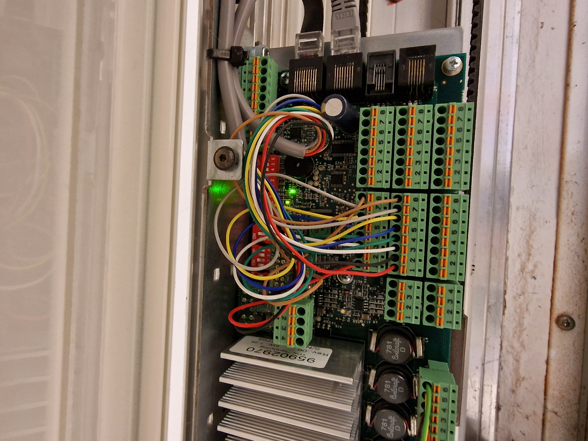
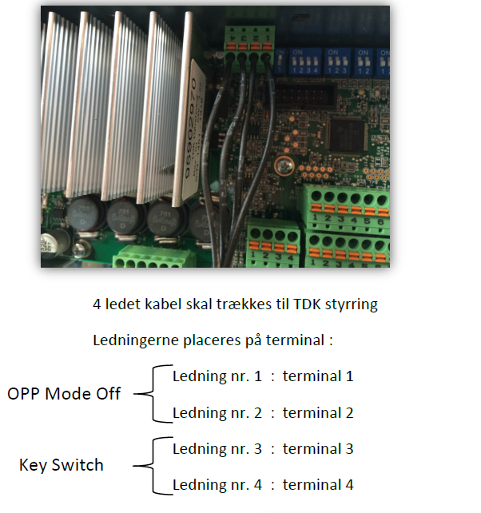

# TORMAX TDK Controller 001

## Wiring

* 1 and 2 closes and locks the door when shorted - the door cannot open before 1 and 2 is released.
* 3 and 4 must have a pulse - then the door opens once in 5 seconds or until the sensor is not active, then it closes and locks.ser.

